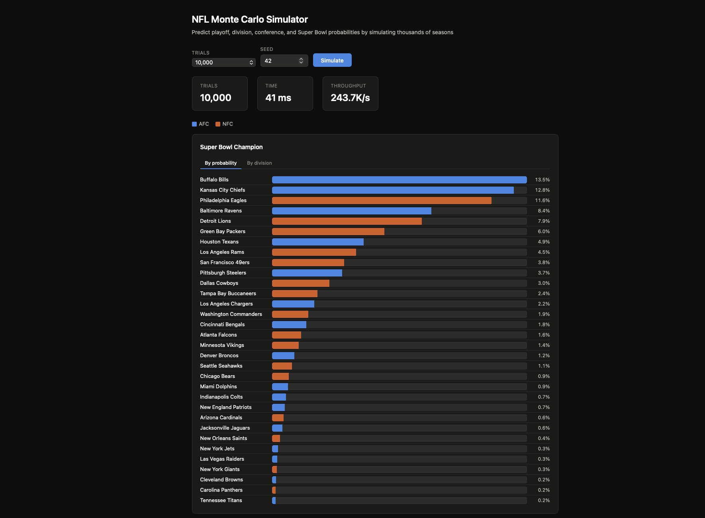

[](https://github.com/ervinjohn50/nfl-monte-carlo-simulator/actions)

# NFL Monte Carlo Season Simulator

A multithreaded C++17 Monte Carlo simulator that predicts NFL playoff, division-title, and Super Bowl probabilities by simulating thousands of independent seasons using an Elo rating model. Includes an interactive web dashboard for visualizing results in real time.



```
./build/nfl_simulator --trials 20000 --threads 4
Loading teams from data/teams.csv...
Loaded 32 teams.
Generated schedule with 272 games.
Running 20000 season simulations across 4 thread(s)...
Done in 77.8 ms (257065.1 seasons/sec)

Team                        Playoff%      Div%     Conf%   SB Champ%
--------------------------------------------------------------------
Buffalo Bills                   88.8      72.7      24.0        13.5
Kansas City Chiefs              81.5      62.1      22.1        12.9
Philadelphia Eagles             83.3      58.2      21.8        11.5
Baltimore Ravens                79.0      51.6      15.6         8.4
Detroit Lions                   68.3      39.4      15.4         8.3
...
```

## Overview

The simulator runs a configurable number of full NFL seasons (regular season + playoffs), each with independent random outcomes weighted by team strength, and aggregates the results into probability estimates. A single trial works as follows:

1. **Copy the team data** — each trial operates on its own independent copy of team ratings and records, ensuring statistical independence across trials
2. **Simulate the regular season** — for each of 272 scheduled games, compute a win probability from the two teams' Elo ratings (with home-field advantage), draw a random outcome, and update both teams' ratings and records
3. **Seed the playoffs** — rank each conference by record to determine the 4 division winners (seeds 1–4) and 3 wild cards (seeds 5–7)
4. **Simulate the playoff bracket** — wild-card round → divisional round → conference championship → Super Bowl (neutral site), using the same Elo win-probability model at each round
5. **Record the outcome** — which teams made the playoffs, won their division, won the conference, and won the Super Bowl

Results across all trials are aggregated into per-team probabilities.

## Key Technical Features

**Elo Rating Model** — Implements the standard logistic win-probability formula with configurable home-field advantage and K-factor. Ratings update after every game using a zero-sum transfer, where upsets produce larger rating swings than expected outcomes. The Super Bowl uses a neutral-site mode with no home-field boost.

**Schedule Generation** — Constructs a structurally valid 272-game, 17-games-per-team schedule using three layered combinatorial techniques:
- Division round-robins (home-and-away for all divisional rivals)
- Cross-group single-leg pairings (within-conference and interconference)
- Randomized 3-regular bipartite graph matching for crossover games, with collision detection to guarantee no duplicate matchups

**Multithreaded Simulation** — Trials are split evenly across configurable worker threads. Each thread maintains its own independent RNG stream (`std::mt19937_64`, seeded with `base_seed + thread_id`) and its own local `AggregateStats` accumulator. There is zero shared mutable state during parallel execution — results are merged once after all threads complete via `.join()`.

**Test Suite** — 25 targeted assertions covering:
- Elo model correctness (symmetry, zero-sum conservation, upset scaling)
- Schedule structural integrity (exact game counts, no self-matches, no invalid repeats)
- Simulation validity (correct playoff field size, trial independence via pass-by-value isolation)
- Aggregate consistency (total playoff appearances = trials × 14, exactly one champion per trial)
- Multithreaded correctness (single-threaded and multi-threaded runs both produce valid results)

## Build & Run

Requires a C++17 compiler. No external dependencies for the CLI. Uses only the C++ standard library.

```bash
# Build the simulator
make

# Run with default settings (10,000 trials, auto-detected thread count)
./build/nfl_simulator

# Run with custom settings
./build/nfl_simulator --trials 20000 --threads 4 --seed 7

# Output results as JSON
./build/nfl_simulator --json --trials 10000

# Build and run the test suite (25 tests)
make test

# Clean build artifacts
make clean
```

### CLI Flags

| Flag | Default | Description |
|---|---|---|
| `--trials N` | 10000 | Number of season simulations to run |
| `--threads N` | Hardware core count | Number of worker threads |
| `--seed N` | 42 | Base RNG seed (for reproducibility) |
| `--teams path` | `data/teams.csv` | Path to team data CSV |
| `--json` | off | Output results as JSON instead of a formatted table |

## Web Dashboard

An interactive browser-based dashboard for running simulations and visualizing results. Adjust trial count and seed, click Simulate, and see probability charts update in real time.

### Setup

```bash
# Create a virtual environment and install Flask (one time)
python3 -m venv .venv && .venv/bin/pip install flask

# Build the simulator and start the dashboard server
make dashboard
```

Then open `http://127.0.0.1:5050` in your browser.

### Features

- **Live simulation** — change trials (1K–100K) and seed, re-run from the browser
- **Four chart categories** — Super Bowl Champion, Conference Champion, Division Winner, Make Playoffs
- **Sort by probability or division** — toggle between ranking and divisional grouping
- **Hover tooltips** — see full stats for any team (Elo, all four probabilities)
- **Performance stats** — trial count, elapsed time, and throughput (seasons/sec)
- **Dark/light theme** — follows your OS preference

## Project Structure

```
include/                    Headers (public interfaces)
├── types.h                   Team, Game, SeasonResult, AggregateStats
├── elo_model.h               Win probability + rating updates
├── schedule_generator.h      Season schedule construction
├── season_simulator.h        Regular season + playoff bracket
├── monte_carlo_runner.h      Multithreaded trial orchestration
└── csv_loader.h              Team data loader

src/                        Implementations
├── elo_model.cpp
├── schedule_generator.cpp
├── season_simulator.cpp
├── monte_carlo_runner.cpp
├── csv_loader.cpp
└── main.cpp                  CLI entry point + report formatting

viz/
└── index.html                Interactive web dashboard (self-contained HTML/CSS/JS)

server.py                   Flask API server (bridges the browser to the C++ binary)

tests/
└── test_main.cpp             25 assertion-based tests (no external framework)

data/
└── teams.csv                 32 teams with conference, division, starting Elo
```

### Architecture

Each module is fully decoupled — the Elo model knows nothing about schedule construction, the schedule generator knows nothing about ratings, and the Monte Carlo runner knows nothing about football. Components communicate only through the data structures defined in `types.h`. Any individual module (a different rating model, a different sport's schedule rules, a different bracket format) can be swapped without touching the others.

## Team Data

`data/teams.csv` uses illustrative starting Elo ratings for demonstration purposes. To produce predictions reflecting a real season, replace the Elo values with actual preseason power ratings.

```csv
name,conference,division,elo
Buffalo Bills,AFC,East,1620
Kansas City Chiefs,AFC,West,1630
Philadelphia Eagles,NFC,East,1610
...
```

## Design Decisions & Simplifications

- **Pass-by-value for trial independence**: `simulate_one_season` takes the teams vector by value (not by reference), guaranteeing each trial starts from the original baseline ratings with no accumulated drift between trials.
- **Per-thread RNG isolation**: Each thread constructs its own `std::mt19937_64` from a unique seed (`base_seed + thread_id`), eliminating shared-state contention and ensuring reproducibility.
- **Simplified tiebreakers**: Playoff seeding uses win percentage then Elo rating, rather than the NFL's full multi-step tiebreaker procedure (common opponents, strength of schedule, etc.).
- **Win/loss-only Elo updates**: Real power rating systems often incorporate margin of victory and efficiency metrics. This project updates ratings based on game outcome alone.
- **No prior-standings scheduling**: The real NFL schedules some crossover games based on prior-year finish position. This project randomizes crossover matchups instead.
- **No injury, weather, or roster modeling**: The simulator treats team strength as a single Elo rating that evolves only through game results within a season.

## Future Improvements

- Backtest against historical seasons to validate model calibration (e.g., do teams given a 60% playoff probability actually make the playoffs ~60% of the time?)
- Add margin-of-victory weighting to the Elo update function
- Incorporate dynamic team-strength adjustment (e.g., mid-season Elo regression toward the mean to model roster changes)
- Replace the CSV loader with a live stats API integration for real-time preseason ratings
- Add a work-stealing thread pool for better load balancing at very high trial counts
- Add an Elo editor to the dashboard for "what if" scenario modeling
